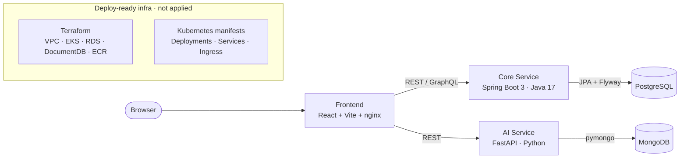

# TaskFlow — Cloud-Native Task Management Platform

TaskFlow is a Trello/Jira-style project and task management platform built as a
polyglot microservice system. It pairs a Spring Boot core (REST + GraphQL) with
a Python AI service that performs **fully offline** smart task prioritization and
similar-task search using TF-IDF and cosine similarity (no external LLM APIs).

## Architecture



## Tech stack

| Layer            | Technology                                                       |
| ---------------- | --------------------------------------------------------------- |
| Frontend         | React 18, TypeScript, Vite, React Router, axios, served by nginx |
| Core service     | Java 17, Spring Boot 3, Spring Data JPA, Spring GraphQL, Flyway   |
| Core database    | PostgreSQL 16                                                     |
| AI service       | Python, FastAPI, Pydantic, scikit-learn (TF-IDF + cosine sim)     |
| AI database      | MongoDB 7 (activity log via pymongo)                             |
| Containerization | Docker / Docker Compose (multi-stage builds)                     |
| IaC              | Terraform (AWS: VPC, EKS, RDS, DocumentDB, ECR)                  |
| Orchestration    | Kubernetes manifests (Deployments, Services, ConfigMap, Secret, Ingress) |
| CI               | GitHub Actions (test + build/push images to GHCR)               |

## Services

| Service        | Port | Responsibility                                                       |
| -------------- | ---- | ------------------------------------------------------------------- |
| `core-service` | 8080 | Boards, tasks, comments; REST + GraphQL; header-based auth          |
| `ai-service`   | 8000 | TF-IDF priority suggestions; MongoDB-backed activity log            |
| `frontend`     | 3000 | React SPA (board list, board detail, "Suggest priority")           |

### Authentication

Authentication is intentionally lightweight but real: clients pass an
`X-User-Id` header that the core service resolves against the `users` table.
Mutating endpoints (and the GraphQL `createTask` mutation) reject requests with a
missing or unknown user via `401 Unauthorized`. There is no OAuth/JWT — the goal
is a clear, inspectable ownership model.

## Getting started

Prerequisites: Docker + Docker Compose.

```bash
docker compose up --build -d
```

This starts PostgreSQL, MongoDB, and all three services. Flyway creates the
schema and seeds demo users, boards, tasks, and comments on first boot.

| URL                                   | What                          |
| ------------------------------------- | ----------------------------- |
| http://localhost:3000                 | Frontend SPA                  |
| http://localhost:8080/api/v1/health   | Core service health           |
| http://localhost:8080/graphiql        | Interactive GraphQL explorer  |
| http://localhost:8000/docs            | AI service OpenAPI docs        |

Tear down (including volumes):

```bash
docker compose down -v
```

## API examples

### REST (core service)

```bash
# List boards (seeded by Flyway)
curl http://localhost:8080/api/v1/boards

# List tasks on a board
curl http://localhost:8080/api/v1/boards/1/tasks

# Create a task (auth required via X-User-Id)
curl -X POST http://localhost:8080/api/v1/boards/1/tasks \
  -H "Content-Type: application/json" \
  -H "X-User-Id: 1" \
  -d '{"title":"Write integration tests","description":"cover the happy path"}'

# Add a comment to a task
curl -X POST http://localhost:8080/api/v1/tasks/1/comments \
  -H "Content-Type: application/json" \
  -H "X-User-Id: 1" \
  -d '{"body":"Looks good to me"}'
```

### GraphQL (core service)

```bash
curl -X POST http://localhost:8080/graphql \
  -H "Content-Type: application/json" \
  -d '{"query":"{ board(id:1){ name tasks { title status comments { body } } } }"}'
```

Mutation (requires the `X-User-Id` header):

```bash
curl -X POST http://localhost:8080/graphql \
  -H "Content-Type: application/json" \
  -H "X-User-Id: 1" \
  -d '{"query":"mutation { createTask(boardId:1, title:\"New task\", description:\"from GraphQL\"){ id title } }"}'
```

### AI service

```bash
# Smart prioritization / similar-task search (TF-IDF + cosine similarity)
curl -X POST http://localhost:8000/api/v1/suggest \
  -H "Content-Type: application/json" \
  -d '{
        "description": "Configure CI pipeline for the project",
        "existing_tasks": [
          "Configure CI pipeline in GitHub Actions",
          "Buy groceries",
          "Design the landing page"
        ]
      }'

# Log task activity (stored in MongoDB)
curl -X POST http://localhost:8000/api/v1/activity \
  -H "Content-Type: application/json" \
  -d '{"task_id":"task-1","action":"commented","actor":"alice","detail":"LGTM"}'

# Retrieve a task's activity
curl http://localhost:8000/api/v1/activity/task-1
```

## How the AI suggestion works

The AI service builds a TF-IDF matrix over the new task description plus every
existing task description, then computes cosine similarity between the new task
and each existing one. Results are ranked by similarity, and a 0–100 priority
score is derived from the strongest match (`30 + maxSimilarity * 70`), on the
heuristic that a task closely resembling active work is more likely to matter
now. Everything runs locally with scikit-learn — there are no external API keys.

## Local development

Each service can also be run on its own:

```bash
# Core service tests
cd services/core-service && mvn test

# AI service
cd services/ai-service
python3 -m venv .venv && source .venv/bin/activate
pip install -r requirements-dev.txt
pytest
uvicorn app.main:app --reload

# Frontend
cd frontend
npm install
npm run dev      # dev server
npm run build    # production build (type-checked)
npx vitest run   # component tests
```

## Infrastructure (deploy-ready, not applied)

The `infra/` directory contains **deploy-ready but unapplied** infrastructure.
No live AWS account was used and no credentials are committed.

- **`infra/terraform/`** — AWS provider config for a VPC, EKS cluster + managed
  node group, RDS PostgreSQL, DocumentDB (Mongo-compatible) cluster, and per-service
  ECR repositories. Validate with:

  ```bash
  cd infra/terraform
  terraform init -backend=false
  terraform validate
  terraform fmt -check
  ```

  `terraform plan`/`apply` are intentionally **not** run — there is no live AWS
  account behind this project.

- **`infra/k8s/`** — Kubernetes manifests (Namespace, ConfigMap, Secret template,
  Deployments, Services, and an Ingress) for all three services. Validate offline
  against the Kubernetes schema with [`kubeconform`](https://github.com/yannh/kubeconform):

  ```bash
  kubeconform -strict -summary infra/k8s/*.yaml
  ```

## Repository layout

```
taskflow-cloud-platform/
├── docker-compose.yml
├── services/
│   ├── core-service/      # Spring Boot 3 (REST + GraphQL + Flyway)
│   └── ai-service/        # FastAPI + scikit-learn + MongoDB
├── frontend/              # React + TypeScript + Vite
├── infra/
│   ├── terraform/         # AWS VPC / EKS / RDS / DocumentDB / ECR
│   └── k8s/               # Kubernetes manifests
└── .github/workflows/     # CI: test + build images
```

## License

MIT
